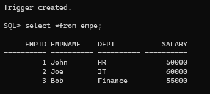
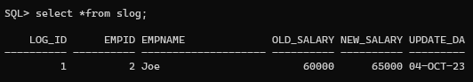

# Ex. No: 5 Creating Triggers using PL/SQL
## DATE:
## AIM: 
To create a Trigger using PL/SQL.

## Steps:
1. Create employee table with following attributes (empid NUMBER, empname VARCHAR(10), dept VARCHAR(10),salary NUMBER);
2. Create salary_log table with following attributes (log_id NUMBER GENERATED ALWAYS AS IDENTITY, empid NUMBER,empname VARCHAR(10),old_salary NUMBER,new_salary NUMBER,update_date DATE);
3. Create a trigger named as log_salary-update.
4. Inside the trigger block, Insert the values into the salary_log table whenever the salary is updated.
5. End the trigger.
6. Update the salary of an employee in employee table.
7. Whenever a salary is updated for the employee it must be logged into the salary_log table with old salary and new salary.
8. Display the employee table, salary_log table.

## Program:
### Create employee table
```
create table empe( empid number,empname varchar(10),dept varchar(10),salary number);
```
### Create salary_log table
```
create table slog(log_id number GENERATED ALWAYS AS IDENTITY,empid NUMBER,empname varchar(20),old_salary number,new_salary number,update_date date);
```
### PLSQL Trigger code
```
CREATE OR REPLACE TRIGGER slog_update
BEFORE UPDATE ON empe
FOR EACH ROW
DECLARE
	v_old_salary NUMBER;
	v_new_salary NUMBER;
BEGIN
	v_old_salary := :OLD.salary;
	v_new_salary := :NEW.salary;

	IF v_old_salary <> v_new_salary THEN
		INSERT INTO slog (empid,empname,old_salary,new_salary,update_date)
		VALUES (:OLD.empid,:OLD.empname,v_old_salary,v_new_salary, SYSDATE);
END IF;
END;
/

update empe set salary =65000 where empid=2;

select *from slog;
```
## Output:





## Result:
   Thus a trigger is created using PL/SQL.
